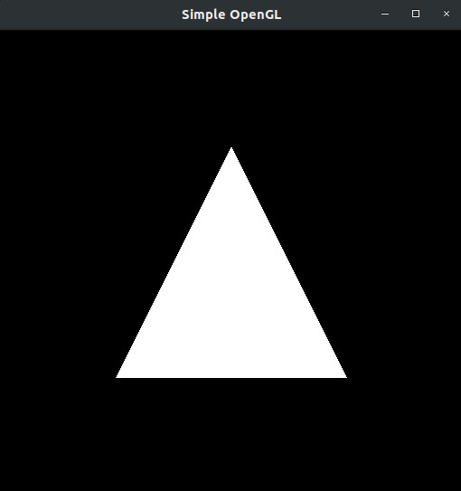

Introdução á Computação Gráfica - Atividade Prática II
---

Disciplina: [GDSCO0051] Introdução à Computação Gráfica - Turma 02.

Professor: Christian Azambuja Pagot (email: christian@ci.ufpb.br).

Alunas: 
        
        Ana Flavia S. Aragão Moura; 20160164270

        Thuane Mikaella de França; 11325835

---

## Índice

* [Introdução](#introdução)
* [Setup](#setup)
* [Desenvolvimento](#desenvolvimento)
* [Conclusão](#conclusão)
* [Referências Bibliográficas](#referências-bibliográficas)

---


### Introdução

Este trabalho foi desenvolvido para a disciplina de Introdução à Computação Gráfica, ministrada pelo Prof. Dr. Christian Azambuja Pagot na

Universidade Federal da Paraíba, UFPB. Com a finalidade de verificar se o ambiente de desenvolvimento em OpenGL 3.3 está corretamente 

configurado nos computadores de todos os aluno da disciplina, bem como familizarizar os alunos com a estrutura de um programa OpenGL 

moderno utilizando o framework disponibilizado pelo professor.


---


### Setup


Utilizamos o sistema operacional Linux distribuição Unbuntu 18.04.04 LTS. Para a compilação exige  requisitos do OpenGL e o GLUT (The OpenGL Toolkit) sejam armazenados. Após a instalação:

```sh
$ make

$ ./cgprog
```


### Desenvolvimento


A principio fizemos o download do programa OpenGL New disponiilizado no GitHub so professor. Após o download, foi feito a compilação e o programa foi executado. Durante a compilação alguns warnings apareceram na tela.

Na nossa primeira tentativa o triangulo apraceu completamente branco. Como mostrado na Figura 1:


<p align="center">
	<br>
	
	<h5 align="center">Figura 1 - Janela OpenGL criada durante a execução do programa com erro</h5>
	<br>
</p>


Dado essa problematica, pesquisamos e executamos um Export no terminal, pcom essa raviavel de ambiente para forçar a versão do mesmo utilizada ser a 3.3:

```sh
$ export MESA_GL_VERSION_OVERRIDE=3.3

$ make

$ ./cgprog
```

Uma vez compilado, ao ser executado, o programa apresentar uma janela contendo um triangulo colorido, como ilustra a Figura 2:


<p align="center">
	<br>
	
	<h5 align="center">Figura 2 - Janela OpenGL criada durante a execução do programa</h5>
	<br>
</p>


Podemos obeservar que o programa foi executado com sucesso, logo o objetivo foi satisfeito.


### Conclusão


Nesta atividade prática, pudemos setar corretamente as configurações necessarias, para que o programa executasse com exito.  A

principio tivemos tivemos dificuldade pois, o programa não estava aparecendo a janela OpenGL, mesmo usando o OpenGL 4.0. Depois 

de muitas tentativas percebemos que o programa só executava com exito usando a versão especifica 3.3 do OpenGl e finalmente 

conseguimos executar, sendo assim o ponto de partida para outros projetos utilizando o OpenGL New.


### Referências Bibliográficas


* Notas de aula do Prof. Christian
