Introdução á Computação Gráfica - Trabalho III - Atividade Prática 3 - Implementação do Pipeline Gráfico
---

Disciplina: [GDSCO0051] Introdução à Computação Gráfica - Turma 02.

Professor: Christian Azambuja Pagot (email: christian@ci.ufpb.br).

Alunas: 
        
        Ana Flavia S. Aragão Moura; 20160164270

        Thuane Mikaella de França; 11325835

---

## Índice

* [Introdução](#introdução)
* [Setup](#setup)
* [Pipeline Gráfico](#pipeline-gráfico)
	* [Object Space](#object-space)
	* [World Space](#world-space)
	* [Camera Space](#camera-space)
* [A Atividade](#a-atividade)
	* [Exercício 1 Escala](#exercício-1-escala)
	* [Exercício 2 Translação](#exercício-2-translação)
	* [Exercício 3 Projeção Perspectiva](#exercício-3-projeção-perspectiva)
	* [Exercício 4 Posição da Camêra](#exercício-4-posição-da-camêra)
	* [Exercício 5 Transformações Livres](#exercício-5-transformações-livres)
* [Conclusão](#conclusão)
* [Referências Bibliográficas](#referências-bibliográficas)

---


### Introdução
Este trabalho foi desenvolvido para a disciplina de Introdução à Computação Gráfica, ministrada pelo Prof. Dr. Christian Azambuja Pagot na Universidade Federal da Paraíba, UFPB. 

Com o objetivo de nos familiarizar com a estrutura do pipeline gráfico através da implementção das transformações geometricas que compõe a estrutura. Esta implementação será feita

com auxílio da biblioteca glme sua execução  ocorrerá nos shaders do OpenGL.

---


### Setup

Utilizamos o sistema operacional Linux distribuição Unbuntu 18.04.04 LTS. Para a compilação no OpenGL moderno exige como requisitos, a biblioteca GLM e a biblioteca GLEW, possa ser compilado com sucesso. Esta atividade será realizada a partir de um código de modelo C ++ fornecido pelo professor, disponível no repositório do GitHub. Após a instalação:


Uma vez que todas as depedencias estejam satisfeitas, pode-se passar para a compilação do código template. O comando de compilação em sistemas Linux deverá ser:

```sh
$ g++ -Wall -Wextra -Wpedantic -std=c++17 -O0 -g3 -DDEBUG main.cpp -lglut -lGLEW -lGLU-lGL -o transformgl

$ make
```

**Os codigos dessa atividade estão na pasta "03_transformations". Para ter acesso, basta descomentar a atividade que queira executar.**

Uma vez compilado  alguns warnings poderao  aparecer  na  tela. Ao  ser executado, o programa deverá apresentar uma janela contendo dois triângulos coloridos, como ilustraa Figura 1. 

<p align="center">
	<br>
	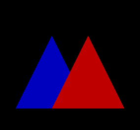
	<h5 align="center">Figure 1: Janela OpenGL criada durante a execução do programa</h5>
	<br>
</p>


### Pipeline Gráfico

O pipeline gráfico é um modelo conceitual que compreende a sequência de etapas necessárias para transformar a descrição matemática / geométrica de uma cena em uma imagem discreta na tela.
Descreve quais etapas um sistema gráfico precisa executar para renderizar uma cena 3D em uma tela 2D. Consiste em uma série de transformações algébricas que são divididas em alguns estágios. 
Basicamente, cada etapa do pipeline transforma descrições geométricas de um sistema de coordenadas (espaço) para outro.

Na figura 2, podemos observar todos os passos do pipeline gráfico.

<p align="center">
	<br>
	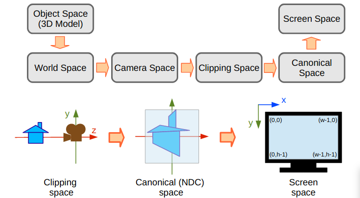
	<h5 align="center">Figure 2: Representação completa do pipeline gráfico</h5>
	<br>
</p>


### Object Space

Partindo do modelo de Descrição que é realizado no sistema de coordenadas do objeto (ou espaço do objeto). O espaço objeto é o espaço onde cada objeto é criado e modelado a partir de suas primitivas geométricas utilizando seu próprio sistema de coordenadas.
A primeira etapa do pipeline consiste na passagem de vértices do espaço objeto para o espaço do universo. Essa passagem ocorre pela multiplicação de cada vértice por uma matriz de modelagem (model matrix), que consiste de uma combinação de uma ou mais 
transformações geométricas, que por sua vez também são representadas por matrizes. 


As transformações geométricas são operações que visam a alteração de algumas características, como : posição, orientação, forma e/ou tamanho do objeto a ser desenhado. Elas podem  ser representadas por equações, porém, a manipulação de objetos gráficos envolve
muitas operações aritméticas, sendo assim,  representá-las na forma de matriz  facilitada o seu uso e entendimento. 


<p align="center">
	<br>
	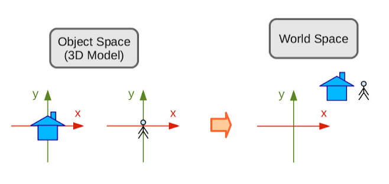
	<h5 align="center">Figure 3: Representação do Onject Space to Wold Spaceo</h5>
	<br>
</p>


### World Space

É feito no sistema de coordenadas mundiais (ou no espaço mundial) ou espço do universo. O espaço do universo é onde todos os objetos ficam reunidos, portanto dividem o mesmo sistema de coordenadas. É no espaço do universo que toma a cena é formada. Agora com a cena formada devemos registrar a cena através de uma câmera, dessa forma somos levas ao espaço da câmera.

### Camera Space

Como apontar a câmera para a cena, câmera define um novo sistema de coordenadas: o Sistema de coordenadas da câmera (ou espaço da câmera). Quando colocamos a câmera na cena temos que transformar todos os pontos do espaço do universo para um novo sistema de coordenadas, o sistema da câmera. Para criar esse novo sistema de coordenadas precisamos informar a posição da câmera (EYE) no espaço do universo, o vetor direção (AT), para onde a câmera aponta, e o vetor (UP), que é o vetor que aponta para parte superior da câmera. Com esse parâmetros podemos criar o sistema de coordenadas do espaço da câmera.

--------------------------------------------------------------------------------------------------------------

### A Atividade


 Atividade consiste em se alterar, no programa template, os conteudos das matrizes MModel, MView e MProjectionde forma que o programa gere as imagens abaixo.
 
 ### Exercício 1 Escala 
 
 Escalonar significa redimensionar um objeto, ou seja, aumentar ou diminuir suas dimensões, deformá-lo ou até mesmo espelhá-lo. Modificamos a matriz Model, ou seja, 
 modificamos os fatores de escala em (x,y,z) = (1/3,3/2,1). Na matiz Model modificamos basicamentos os parametros da matriz, em ponto flutuante de forma que a imagem 
 gerada pelo programa fique como a da Figura X abaixo:
 
 <p align="center">
	<br>
	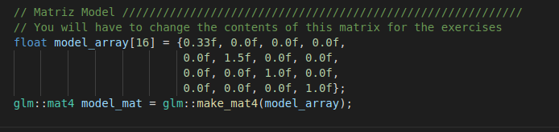
	<h5 align="center">Figure x: Codigo da Modificação da Matriz Model, equivalente a escala (x,y,z) = (1/3,3/2,1).</h5>
	<br>
</p>

<p align="center">
	<br>
	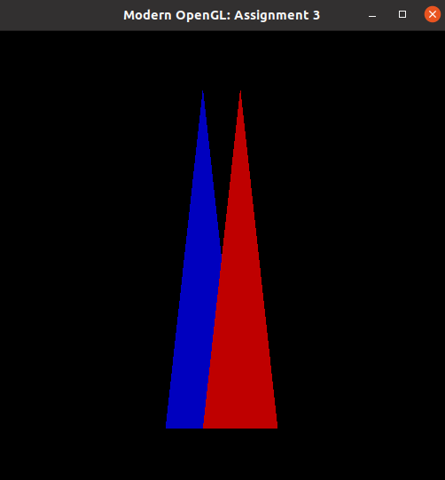
	<h5 align="center">Figure x: Escala (x,y,z) = (1/3,3/2,1).</h5>
	<br>
</p>
 
 
 ### Exercício 2 Translação
 
 Transladar consiste em movimentar os vértices de um objeto adicionando quantidades às suas coordenadas, ou seja, cada ponto pode ser movido por d unidades ao 
 longo de cada eixo do sistema de coordenadas. 
 
 
 
 <p align="center">
	<br>
	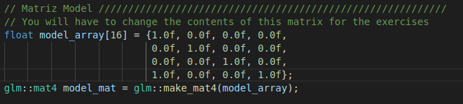
	<h5 align="center">Figure x: Codigo da Modificação da Matriz Model,Translações em (x, y, z) = (1,0,0).</h5>
	<br>
</p>

<p align="center">
	<br>
	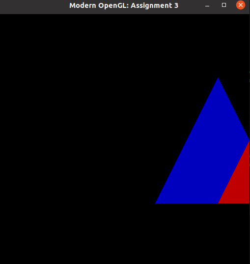
	<h5 align="center">Figure x: Translações em (x, y, z) = (1,0,0).</h5>
	<br>
</p>
 
 ### Exercício 3 Projeção Perspectiva
 
 Modificar a matriz MProjection, considera  a camera na origem do seu sistema de coordenadas. A matriz Projection fazendo com que objetos mais próximos da 
 câmera pareçam maiores e objetos mais distantes pareçam menores.
 
 
 <p align="center">
	<br>
	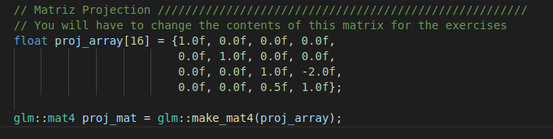
	<h5 align="center">Figure x: Codigo da Modificação da Matriz Projection Parâmetro d=1/2.</h5>
	<br>
</p>

<p align="center">
	<br>
	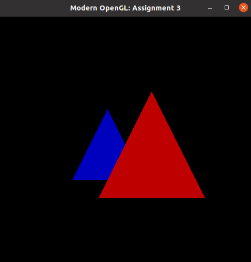
	<h5 align="center">Figure x: Modificação da Matriz Projection Parâmetro d=1/2.</h5>
	<br>
</p>
 
 
 
### Exercício 4 Posição da Camêra

Modificar a matriz MView para a realização deste exercício, determinar inicialmente os vetores da base do espaço camera a partir das informaçoes constante Posição da camera = (−110,110,14), vetor Up da camera = (0,1,0), ponto para o qual a caamera está apontando = (0,0,0).
  
 
 - Primeiro criamos três vetores glm como parametros da camera em relação ao posição, up e apontando. Depois usamos o metodo analize para as três eixos de cameras. Pegando a dica do porfessor, O vetor de direção da camera  foi  obtido subtraindo-se a posiçao da camera do ponto para o qual ela está apontando.
 
Utilizamos a dica do professor mais uma vez, assim para implementar a matriz 4x4 na glm devemos primeiro  entao passa-lo como argumento para a função glm:: mat4, que enta o retornara uma matriz da glm do tipo glm::mat4.A pos isso construimos a matriz_B da base da camera e invertemos, calculando sua trasposta  matrix_T. Em seguida, vamos determinar a matriz_T que translada a base da camera, e faz a sua origem coincidir com a do espaçodo universo.  Em seguida, os construir a matrix MView como o roduto das matrizes BT e T e entao aplicar a transformação da MView sobre os vertices dos triangulos.
 
Onde temos a posição da câmera: o ponto em relação à sua posição; Alvo da câmera: o ponto em que está olhando; Direção: a distância entre alvo e posição;Vetor UP: um vetor que representa o que seria procurar no Espaço Universo, que, neste caso, é considerado igual ao vetor unitário que representa o eixo y do Universo. 
Após esse procedimento, é necessário construir as matrizes que formarão a View.

 - Matriz B: Representa os pontos do sistema de coordenadas do Universo no novo sistema relacionado ao Espaço da câmera.
 - Matriz T: Usado para converter todos os vértices com o ponto de posição para posicionar a câmera na origem.
 - Visualização de matriz: para combinar essas matrizes e gerar a visualização de matriz, é necessário multiplicar apenas uma pela outra.

Em outras palavras, utilizando como parametro as posiçoes da camera contruimos a matriz_B e sua matriz_T a tranposta de B. E obtemos o resultado multiplicando-as matrix_B * matrix_T, como podemos observar nas figura a baixo:
 
 
 
  <p align="center">
	<br>
	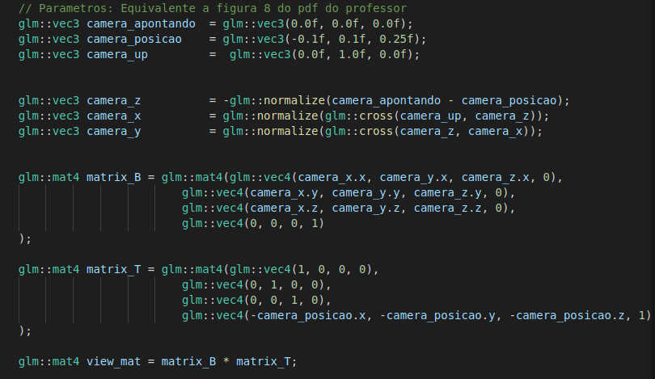
	<h5 align="center">Figure x: Codigo da Modificação da Posição da camera = (−110,110,14), vetor Up da camera = (0,1,0), ponto para o qual a caamera está apontando = (0,0,0).</h5>
	<br>
</p>


<p align="center">
	<br>
	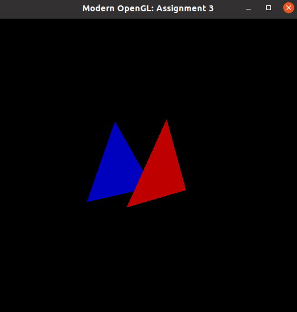
	<h5 align="center">Figure x: Modificação da Posição da camera = (−110,110,14), vetor Up da camera = (0,1,0), ponto para o qual a caamera está apontando = (0,0,0).</h5>
	<br>
</p>
  
 
 
 ### Exercício 5 Transformações Livres
 
 Foi feito modificações nas  matrizes MModel,MView e MProjection onde forma a gerarem uma cena diferente das geradas anteriormente. Ou seja ajuste todas as posiçoes x para 3 nas três matrizes do codigo modelo. Ouve transformaçoes nas três matrizes!
 
  <p align="center">
	<br>
	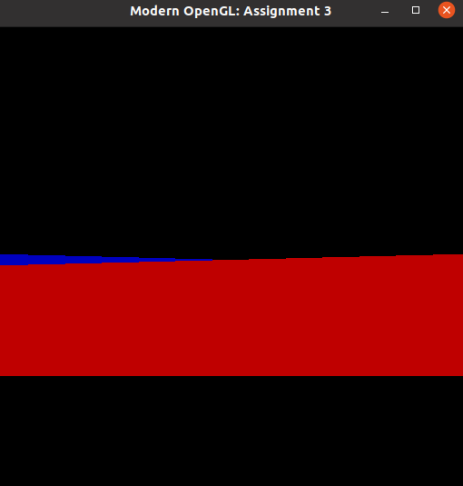
	<h5 align="center">Figure x: matrizes MModel,MView e MProjection .</h5>
	<br>
</p>
  

### Conclusão 

Nesta atividade podemos entender os passos do pipeline gráfico, e implementar de acordo com a orientaço do professor. A maior dificuldade neste trabalho esteve nos detalhes implementação das transformações, em implementar especificamente a atividade 4, relacionado a posição da camera. Tivemos que pesquisar sobre a utilização da biblioteca GLM - OpengGL Mathematics e ler a docuemntação com cautela para avançar nas atividades.


### Referências Bibliográficas

* Material de Aula do professor Christian Pagot
* GLM  OpenGL Mathematics
* Chapter 6  Fundamentals of Computer Graphics - Peter Shirley

