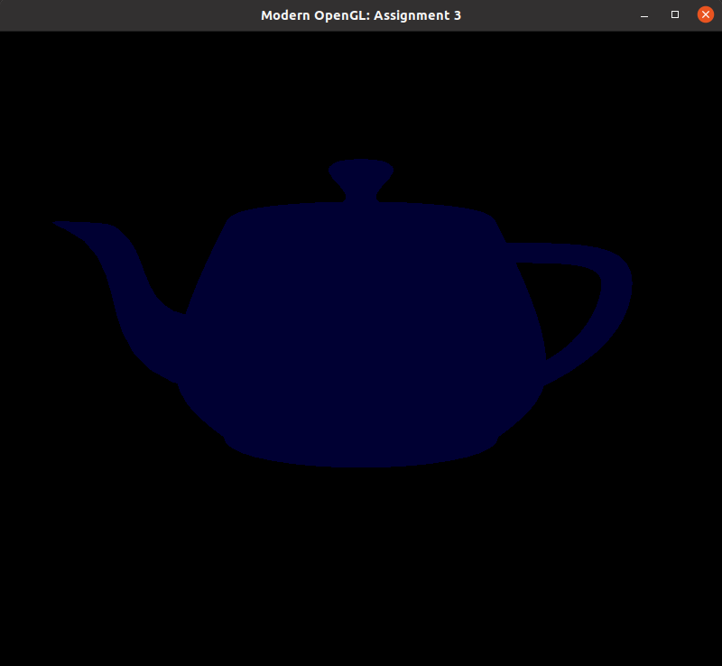

Introdução á Computação Gráfica - Trabalho 3
---

Disciplina: [GDSCO0051] Introdução à Computação Gráfica - Turma 02.

Professor: Christian Azambuja Pagot (email: christian@ci.ufpb.br).

Alunas: 
        
        Ana Flavia S. Aragão Moura; 20160164270

        Thuane Mikaella de França; 11325835

---

## Índice

* [Introdução](#introdução)
* [Setup](#setup)
* [A Atividade](#atividade)
	* [Exercício 1 Implementação do Modelo de Reflexão Difuso](#exercício-1-implementação-do-modelo-de-reflexão-difuso)
	* [Exercício 2 Implementação do Modelo de Reflexão Especular](#exercício-2-implementação-do-modelo-de-reflexão-especular)
* [Conclusão](#conclusão)
* [Referências Bibliográficas](#referências-bibliográficas)

---


### Introdução

Este trabalho foi desenvolvido para a disciplina de Introdução à Computação Gráfica, ministrada pelo Prof. Dr. Christian Azambuja Pagot na Universidade Federal da Paraíba, UFPB. 

Com o objetivo de nos familiarizar os modelos de iluminação tradicionalmente utilizados na rasterização: ambiente, difuso e especular (ou Phong). Para isto, é necessario implementar os três modelos utilizando o vertex shader do OpenGL.

---


### Setup

Utilizamos o sistema operacional Linux distribuição Unbuntu 18.04.04 LTS. Para a compilação exige requisitos do OpenGL o OpenGL Mathematics (GLM) e o GLEW OpenGL (Extension Wrangler Library) sejam intsalados. Após isso, para  compilação e execução do Código Template usamos os seguintes comandos dentro da pasta 04_shading,  um comando apoś o outro:

```sh
$ make

$ g++ -Wall -Wextra -Wpedantic -std=c++17 -O0 -g3 -DDEBUG main.cpp -lglut -lGLEW -lGLU -lGL -o shading_gl

$./shading_gl
```

<p align="center">
	<br>
	
	<h5 align="center">Figura 1 - Resultado do codigo Template</h5>
	<br>
</p>

### A Atividade


### Exercício 1: Implementação do Modelo de Reflexão Difuso

Nesta atividade modificamo o vertex shader (arquivo vertex_shader.glsl), disponibilizado pelo professor, de forma que ele passe a incluir, além do modelo de iluminação ambiente, também o modelo difuso. Para isto, será necessário calcular o novo valor do vetor normal N, após as transformações feitas pela matriz Model, bem como o vetor L que aponta do vértice para a fonte de luz. Utilizando a sugestões de cálculo destes dois vetores, definido pelo professor.


Foram feitas modificaçãoes nos arquivos, vertex_shader.glsl e no main.cpp. Para isto, foi necessario calcular os  cálculos dos vetores N e L, o modelo de iluminação difuso. Modificando assim o arquivo vertex_shader.glsl para adicionar estes passos, utilizandoas sugestões de cálculo dos dois vetores indicada pelo professor.

Basicamente rescrevemos os calculos e para implementar a logica no cpp e mudamos parametros de acordo com que foi requisitado pela atividade.


<p align="center">
	<br>
	
	<h5 align="center">Figura 3 - : Renderização do Utah Teapot utilizando o modelo I = Iaκa +Ipκd cos θ (ambiente + difuso),onde Ia = (0.2, 0.2, 0.2), κa = 	(0, 0, 1), posição da fonte de luz igual a (−2, 2, 1.5), Ip = (0.8, 0.8, 0.8) e κd = (0, 0, 0.8).
	<br>
</p>


### Exercício 2: Implementação do Modelo de Reflexão Especular


Modificar o vertex shader (arquivo vertex_shader.glsl) do exercício anterior de forma que ele passe a incluir, além do modelo de iluminação ambiente e difuso, também o modelo especular, ou de Phong. Para isto, será necessário calcular o vetor R, de reflexão da luz L, e o vetor da câmera V, que aponta
do vértice em questão para a câmera. DE acordo com a sugestões de cálculo destes dois vetores, disponibilizado pelo professor.

<p align="center">
	<br>
	
	<h5 align="center">Figura 3 -  Renderização do Utah Teapot utilizando o modelo I = Iaκa + Ip(κd cos θ + κs(cos α)n)
(Phong), onde Ia = (0.2, 0.2, 0.2), κa = (0, 0, 1), posição da fonte de luz igual a (−2, 2, 1.5), Ip =(0.8, 0.8, 0.8), κd = (0, 0, 0.8), κs = (1, 1, 1) e n = 64.</h5>
	<br>
</p>


### Conclusão

Neste projeto podemos colocar em prática os conceitos aplicado na sala de aula virtual, e implementando de forma pática os modelos de iluminação tradicionalmente utilizados na rasterização: ambiente, difuso e especular (ou Phong). Sendo necessario implementar os três modelos utilizando o vertex shader do OpenGL. O nivel de dificuldade foi razoavel, tendo em vista o fim de periodo com muitas atividades em execução em paralelo. Porém, foi muito proveitoso e desafiador esse periodo a distancia. Pois é uma nova realidade, algumas vezes com dificuldade e falhas na rede, por isso friso a importancia das aulas gravadas. Não mais, gostaria de dizer que foi muito proveitoso e agradeço pelas aulas e sua otima didatica. 

### Referências Bibliográficas

* Notas de aula do Prof. Christian

