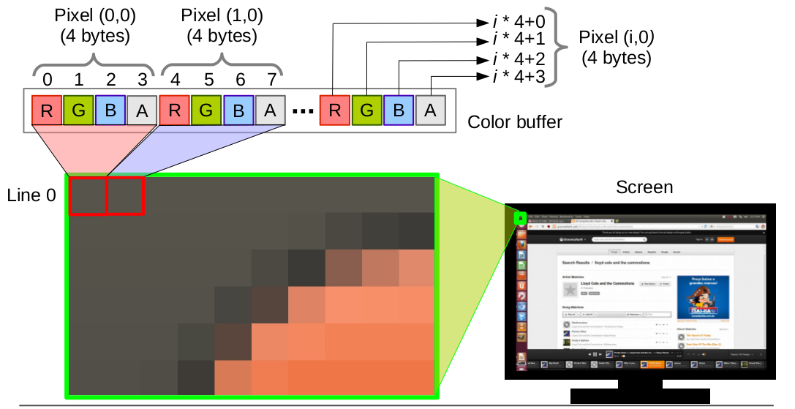

Introdução á Computação Gráfica - Trabalho 3
---

Disciplina: [GDSCO0051] Introdução à Computação Gráfica - Turma 02.

Professor: Christian Azambuja Pagot (email: christian@ci.ufpb.br).

Alunas: 
        
        Ana Flavia S. Aragão Moura; 20160164270

        Thuane Mikaella de França; 11325835

---

## Índice

* [Introdução](#introdução)
* [Setup](#setup)
* [](#)
	* [](#)
* [](#)
	* [](#)
	* [](#)
* [Conclusão](#conclusão)
* [Referências Bibliográficas](#referências-bibliográficas)

---


### Introdução

Este trabalho foi desenvolvido para a disciplina de Introdução à Computação Gráfica, ministrada pelo Prof. Dr. Christian Azambuja Pagot na Universidade Federal da Paraíba, UFPB. 

Com o objetivo de nos familiarizar com os algoritmos de rasterização utilizados em computação gráfica. Aprendemos na prática como rasterizar pontos, linhas e triângulos através da rasterização das linhas.

Simulando o acesso direto a memória de vídeo utilizando um framework, fornecido pelo professor, que simula o acesso à memória de vídeo. 

---


### Setup

Utilizamos o sistema operacional Linux distribuição Unbuntu 18.04.04 LTS. Para a compilação exige  requisitos do OpenGL e o GLUT (The OpenGL Toolkit) sejam armazenados. Após a instalação:

```sh
$ make

$ ./cgprog
```


### Setup


<p align="center">
	<br>
	
	<h5 align="center">Figura 1 - Disposição dos pixels na memória</h5>
	<br>
</p>

