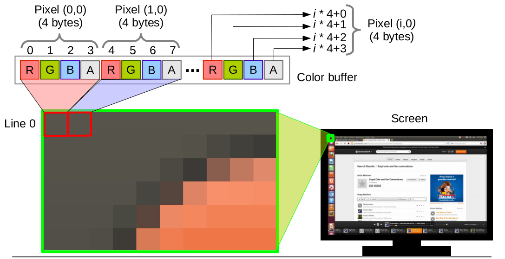
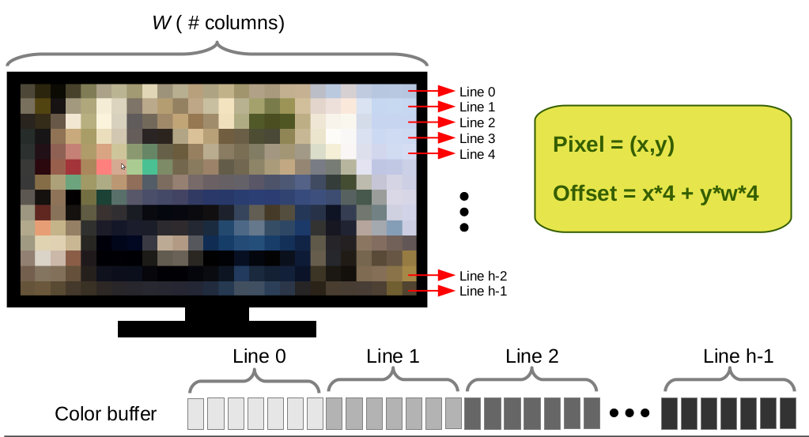
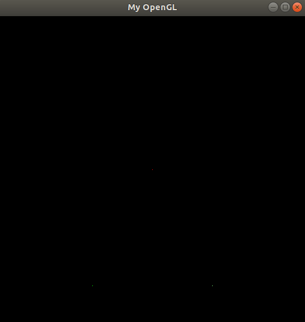
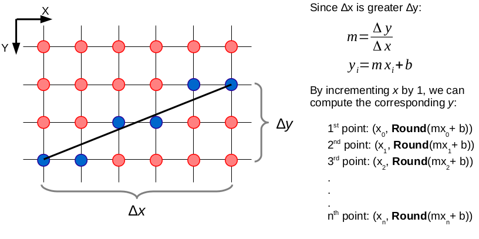
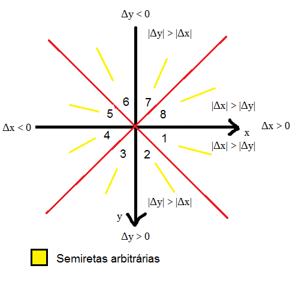

Introdução á Computação Gráfica - Trabalho I
---

Disciplina: [GDSCO0051] Introdução à Computação Gráfica - Turma 02.

Professor: Christian Azambuja Pagot (email: christian@ci.ufpb.br).

Alunas: 
        
        Ana Flavia S. Aragão Moura; 20160164270

        Thuane

---

## Índice

* [Introdução](#introdução)
* [Setup](#setup)
* [Pixels](#pixels)
	* [Ponto](#ponto)
* [Algoritmo de Bresenham](#algoritmo-de-bresenham)
	* [Linhas](#linhas)
	* [Triângulos](#triângulos)
* [Interpolação Linear de Cores](#interpolação-linear-de-cores)
* [Conclusão](#conclusão)
* [Contribuidores](#contribuidores)
* [Referências Bibliográficas](#referências-bibliográficas)

---


### Introdução
Este trabalho foi desenvolvido para a disciplina de Introdução à Computação Gráfica, ministrada pelo Prof. Dr. Christian Azambuja Pagot na Universidade Federal da Paraíba, UFPB. 

Com o objetivo de nos familiarizar com os algoritmos de rasterização utilizados em computação gráfica. Aprendemos na prática como rasterizar pontos, linhas e triângulos através da rasterização das linhas.

Simulando o acesso direto a memória de vídeo utilizando um framework, fornecido pelo professor, que simula o acesso à memória de vídeo. 

---
### Setup

Utilizamos o sistema operacional Linux distribuição Ubunto 2018. Para a compilação exige  requisitos do OpenGL e o GLUT (The OpenGL Toolkit) sejam armazenados. Após a instalação:

```sh
$ make

$ ./cgprog
```

### Pixels

Os monitores da atualidade são compostos por uma malha de pixels, formando um espaço bidimensional. Porém, a disposição desses pixels na memória de vídeo se dá de forma linear, onde todos os pixels são armazenados de forma contínua no que chamamos de *colour buffer*.Assim, é necessário calcular um offset para que cada pixel da tela, dada sua posição (x,y) ocupe um único e distinto espaço em memória. Este fato deve ser levado em consideração quando se trabalha com a manipulação de pixels.

A maioria dos monitores no mercado utilizam o padrão RGBA, onde cada pixel possui 4 componentes de cor: R para vermelho (RED), G para verde (GREEN), B para azul (BLUE) e A para transparência (ALPHA). Cada componente ocupa 1 byte do *colour buffer*, totalizando 4 bytes por pixel. O esquema de Image Storage está exemplificado na imagem apresentada:


<p align="center">
	<br>
	
	<h5 align="center">Figura 1 - Disposição dos pixels na memória</h5>
	<br>
</p>

### Ponto

Portanto, podemos de endereçar cada pixel (e cada canal de cor) no *colour buffer* da seguinte forma:

<p align="center">
	<br>
	
	<h5 align="center">Figura 2 - Endereçamento de pixels no colour buffer</h5>
	<br>
</p>

Portanto, foi implementado um tipo estruturado **pixel** contendo todas as informações de coordenadas e cores dele:

```C++
typedef struct Pixel {
    int x;
    int y;

    double red;
    double green;
    double blue;
    double alpha;
} Pixel;
```

A fim de desenhar um pixel na tela, foi criada a função **putPixel()** que recebe como parâmentro um pixel (com suas informações de cor e coordenadas) e rasteriza um ponto na tela. No framework desenvolvido pelo professor, existe um ponteiro **FBPtr** que aponta para a primeira posição do *colour buffer*, e isso possibilitou a implementação de tal função:

``` C++
void putPixel(Pixel p) {
	
	if(p.x>IMAGE_WIDTH || p.x<0 || p.y>IMAGE_HEIGHT || p.y<0) return; 
	
	int endereco = p.x*4 + p.y*4*IMAGE_WIDTH;
	FBptr[endereco] = p.red;
	FBptr[endereco + 1] = p.green;
	FBptr[endereco + 2] = p.blue;
	FBptr[endereco + 3] = p.alpha;
}
```
Obtivemos esses resultados:
<p align="center">
	<br>
	
	<h5 align="center">Figura 3 - Função putPixel()</h5>
	<br>
</p>

### Algoritmo de Bresenham

A etapa mais complicada do projeto foi a rasterização de linhas. Para isso, foi criada a função **drawLine()**, que recebe dois pixels como parâmetro, e desenha uma reta aproximada entre eles.

Para essa função foi utilizado o algoritmo de Bresenham, muito utilizado na computação para rasterização de linhas. O algoritmo de Bresenham, de forma simplificada, busca aproximar uma reta (que sabemos que é contínua), para um universo discreto. Para isso, transforma-se a linha a ser desenhada em uma equação de reta, da forma y = mx + b.

A cada incremento de x, y incrementa baseado na inclinação m. Isso, porém, quer dizer que y assumirá valores de pontos flutuante, o que dificulta a representação por meio de pixels. O algoritmo de Bresenham chega então na etapa de decisão: a cada vez que x muda, verifica-se se o valor de y equivalente está mais próximo do y atual, ou de y + 1. Após a decisão, o pixel escolhido é acendido. Isso pode ser visto de uma forma melhor na seguinte imagem: 

<p align="center">
	<br>
	
	<h5 align="center">Figura 4 - Linha de Bresenham </h5>
	<br>
</p>

Porém, da forma apresentada, o algoritmo funciona apenas para linhas no primeiro octante. Isso é, o octante em que o deslocamento em xe y são positivos, e a inclinação da reta está entre 0º e 45º graus. 

<p align="center">
	<br>
	
	<h5 align="center">Figura 5 - Octantes </h5>
	<br>
</p>

